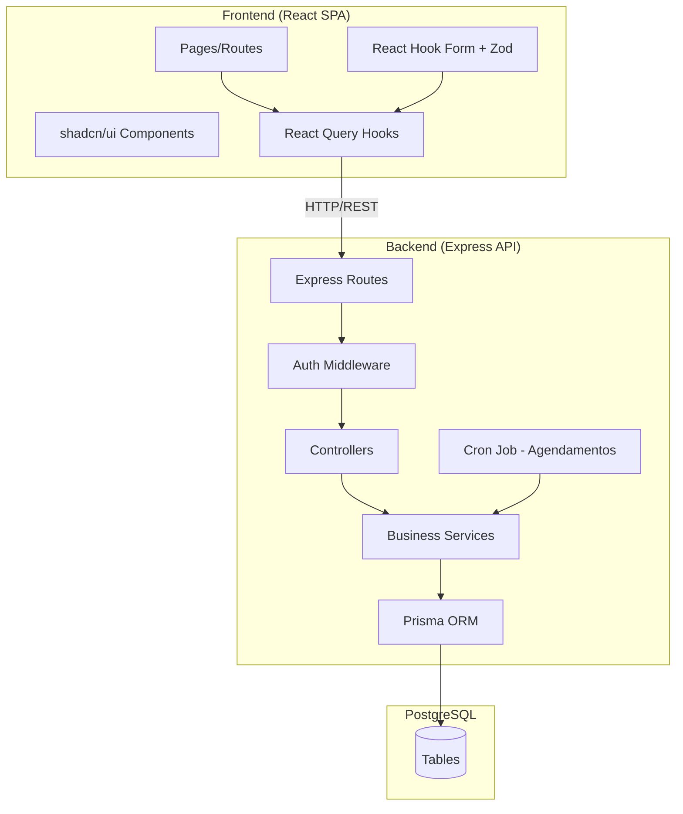
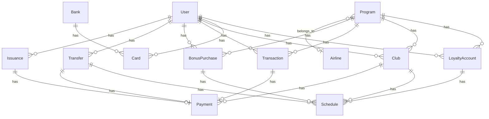

# Design Técnico — Gestor Milhas

## Visão Geral

O Gestor Milhas é um sistema web para gestão individual de milhas e pontos de programas de fidelidade. A arquitetura segue o padrão cliente-servidor com uma SPA React no frontend e uma API REST Express no backend, ambos em TypeScript. O banco de dados PostgreSQL armazena todos os dados persistentes, acessado via Prisma ORM.

O sistema possui dois perfis de acesso (Admin e Usuário) e abrange: autenticação com JWT, páginas públicas (landing page, funcionalidades, contato), cadastro de usuários, gestão de programas de fidelidade, contas de fidelidade com cálculo de preço médio, cartões de crédito, clubes de milhas com agendamentos automáticos, movimentações (compra, bonificada, transferência), emissão de passagens, sistema de agendamentos, dashboards e métricas.

### Decisões de Design

- **Autenticação JWT**: Tokens stateless com refresh token para sessões longas. Sem auto-cadastro — Admin cria usuários.
- **Cálculo de preço médio centralizado**: Um service dedicado (`AveragePriceService`) recalcula o preço médio sempre que o saldo muda, garantindo consistência.
- **Agendamentos via cron job**: Um job diário (timezone `America/Sao_Paulo`) processa agendamentos pendentes, executando operações de crédito/débito.
- **Transações atômicas**: Operações que alteram saldo + preço médio + pagamento são executadas em transações Prisma para garantir consistência.
- **Soft delete para catálogos**: Companhias aéreas e bancos usam status ativo/inativo em vez de exclusão física.

## Arquitetura



### Fluxo de Dados

1. O frontend faz requisições REST via React Query hooks
2. O middleware de autenticação valida o JWT e injeta `userId` e `role` no request
3. Controllers validam input (Zod) e delegam para services
4. Services executam lógica de negócio dentro de transações Prisma
5. O cron job diário consulta agendamentos pendentes e executa as operações via services

### Camadas

| Camada | Responsabilidade |
|--------|-----------------|
| Pages | Rotas e layout das telas |
| Components | Componentes reutilizáveis (shadcn/ui) |
| Hooks | React Query mutations/queries para cada recurso |
| Routes | Definição de endpoints REST |
| Middleware | Autenticação JWT, autorização por role, validação |
| Controllers | Parsing de request, chamada ao service, formatação de response |
| Services | Lógica de negócio, cálculos, transações |
| Prisma | Acesso ao banco, migrations, schema |

## Componentes e Interfaces

### API REST — Endpoints Principais

#### Autenticação
- `POST /api/auth/login` — Login com email/senha, retorna JWT
- `POST /api/auth/refresh` — Refresh do token

#### Usuários (Admin)
- `POST /api/users` — Criar usuário (Admin)
- `GET /api/users` — Listar usuários (Admin)
- `GET /api/users/:id` — Detalhe do usuário (Admin)
- `PUT /api/users/:id/complete-registration` — Completar cadastro (Usuário)

#### Catálogos (Admin)
- `CRUD /api/airlines` — Companhias aéreas
- `CRUD /api/banks` — Bancos
- `CRUD /api/programs` — Programas de fidelidade

#### Contas de Fidelidade
- `GET /api/loyalty-accounts` — Listar contas do usuário
- `GET /api/loyalty-accounts/:id` — Detalhe com saldo e preço médio

#### Cartões
- `CRUD /api/cards` — Cartões de crédito do usuário

#### Clubes
- `CRUD /api/clubs` — Clubes de milhas do usuário

#### Movimentações
- `POST /api/transactions` — Registrar movimentação (compra, bônus, pontos cartão, ajuste)
- `GET /api/transactions` — Listar movimentações do usuário
- `POST /api/bonus-purchases` — Registrar compra bonificada
- `GET /api/bonus-purchases` — Listar compras bonificadas
- `POST /api/transfers` — Registrar transferência
- `GET /api/transfers` — Listar transferências

#### Emissões
- `POST /api/issuances` — Registrar emissão de passagem
- `GET /api/issuances` — Listar emissões

#### Agendamentos
- `GET /api/schedules` — Listar agendamentos pendentes do usuário

#### Dashboard e Métricas
- `GET /api/dashboard/user` — Dashboard do usuário
- `GET /api/dashboard/admin` — Dashboard do admin
- `GET /api/metrics/user/:id` — Métricas do usuário

#### Páginas Públicas
- `POST /api/contact` — Enviar formulário de contato

### Services Principais

```typescript
// AuthService
interface AuthService {
  login(email: string, password: string): Promise<{ accessToken: string; refreshToken: string }>;
  refresh(refreshToken: string): Promise<{ accessToken: string }>;
}

// UserService
interface UserService {
  create(data: CreateUserDTO): Promise<User>;
  completeRegistration(userId: string, data: CompleteRegistrationDTO): Promise<User>;
  findById(id: string): Promise<User>;
  findAll(adminId: string): Promise<User[]>;
}

// AveragePriceService — Centraliza recálculo de preço médio
interface AveragePriceService {
  recalculate(loyaltyAccountId: string, tx?: PrismaTransaction): Promise<void>;
}

// LoyaltyAccountService
interface LoyaltyAccountService {
  getByUser(userId: string): Promise<LoyaltyAccount[]>;
  credit(accountId: string, miles: number, cost: number, tx?: PrismaTransaction): Promise<void>;
  debit(accountId: string, miles: number, tx?: PrismaTransaction): Promise<void>;
  decrementCpf(accountId: string, tx?: PrismaTransaction): Promise<void>;
}

// TransactionService
interface TransactionService {
  create(userId: string, data: CreateTransactionDTO): Promise<Transaction>;
}

// BonusPurchaseService
interface BonusPurchaseService {
  create(userId: string, data: CreateBonusPurchaseDTO): Promise<BonusPurchase>;
}

// TransferService
interface TransferService {
  create(userId: string, data: CreateTransferDTO): Promise<Transfer>;
}

// IssuanceService
interface IssuanceService {
  create(userId: string, data: CreateIssuanceDTO): Promise<Issuance>;
}

// ClubService
interface ClubService {
  create(userId: string, data: CreateClubDTO): Promise<Club>;
  processMonthlyCharge(clubId: string, tx?: PrismaTransaction): Promise<void>;
}

// ScheduleService
interface ScheduleService {
  getPending(userId: string): Promise<Schedule[]>;
  processDaily(): Promise<void>; // Chamado pelo cron job
  execute(scheduleId: string, tx?: PrismaTransaction): Promise<void>;
}

// DashboardService
interface DashboardService {
  getUserDashboard(userId: string): Promise<UserDashboard>;
  getAdminDashboard(adminId: string): Promise<AdminDashboard>;
}
```

### Frontend — Componentes Principais

| Componente | Descrição |
|-----------|-----------|
| `LoginPage` | Formulário de login |
| `CompleteRegistrationPage` | Wizard de cadastro (dados pessoais + endereço) |
| `DashboardPage` | Painel principal com métricas |
| `LoyaltyAccountsPage` | Lista de contas de fidelidade com saldo |
| `CardsPage` | CRUD de cartões |
| `ClubsPage` | CRUD de clubes |
| `TransactionsPage` | Registro e listagem de movimentações |
| `BonusPurchasesPage` | Registro e listagem de compras bonificadas |
| `TransfersPage` | Registro e listagem de transferências |
| `IssuancesPage` | Registro e listagem de emissões |
| `SchedulesPage` | Visualização de agendamentos pendentes |
| `AdminUsersPage` | Gestão de usuários (Admin) |
| `AdminProgramsPage` | Gestão de programas (Admin) |
| `AdminCatalogsPage` | Gestão de companhias aéreas e bancos (Admin) |
| `LandingPage` | Página pública de apresentação |
| `FeaturesPage` | Página pública de funcionalidades |
| `ContactPage` | Formulário de contato público |
| `CepAutoComplete` | Componente de busca de CEP com preenchimento automático |

### Hooks (React Query)

Cada recurso terá um par de hooks:
- `useXxxQuery` / `useXxxMutation` — ex: `useTransactionsQuery`, `useCreateTransactionMutation`
- Hooks de dashboard: `useUserDashboardQuery`, `useAdminDashboardQuery`
- Hook de CEP: `useCepQuery(cep: string)` — consulta API externa (ViaCEP)

### Validação (Zod Schemas)

Schemas Zod compartilhados entre frontend (React Hook Form) e backend (middleware de validação):
- `loginSchema`, `completeRegistrationSchema`
- `programSchema`, `cardSchema`, `clubSchema`
- `transactionSchema`, `bonusPurchaseSchema`, `transferSchema`, `issuanceSchema`
- `contactFormSchema`

## Modelos de Dados

### Diagrama ER (Simplificado)



### Schema Prisma

```prisma
enum Role {
  ADMIN
  USER
}

enum RegistrationStatus {
  PENDING
  COMPLETE
}

enum ProgramType {
  BANK
  AIRLINE
}

enum TransactionType {
  PURCHASE        // compra
  BONUS           // bônus
  CARD_POINTS     // pontos do cartão
  MANUAL_ADJUST   // ajuste manual
}

enum ScheduleType {
  CLUB_CHARGE           // cobrança mensal de clube
  BONUS_PURCHASE_CREDIT // crédito de compra bonificada
  TRANSFER_CREDIT       // crédito de transferência
  TRANSFER_BONUS_CREDIT // crédito de bônus de transferência
  BOOMERANG_RETURN      // retorno de bumerangue
}

enum ScheduleStatus {
  PENDING
  COMPLETED
  FAILED
}

enum PaymentMethod {
  CREDIT_CARD
  PIX
  BANK_TRANSFER
  OTHER
}

model User {
  id                 String             @id @default(uuid())
  email              String             @unique
  passwordHash       String             @map("password_hash")
  role               Role               @default(USER)
  registrationStatus RegistrationStatus @default(PENDING) @map("registration_status")
  fullName           String?            @map("full_name")
  cpf                String?            @unique
  birthDate          DateTime?          @map("birth_date")
  phone              String?
  zipCode            String?            @map("zip_code")
  state              String?
  city               String?
  street             String?
  number             String?
  complement         String?
  neighborhood       String?
  adminId            String?            @map("admin_id")
  admin              User?              @relation("AdminUsers", fields: [adminId], references: [id])
  managedUsers       User[]             @relation("AdminUsers")
  createdAt          DateTime           @default(now()) @map("created_at")
  updatedAt          DateTime           @updatedAt @map("updated_at")

  loyaltyAccounts LoyaltyAccount[]
  cards           Card[]
  clubs           Club[]
  transactions    Transaction[]
  bonusPurchases  BonusPurchase[]
  transfers       Transfer[]
  issuances       Issuance[]

  @@map("users")
}

model Airline {
  id        String   @id @default(uuid())
  name      String   @unique
  active    Boolean  @default(true)
  createdAt DateTime @default(now()) @map("created_at")
  updatedAt DateTime @updatedAt @map("updated_at")

  programs Program[]

  @@map("airlines")
}

model Bank {
  id        String   @id @default(uuid())
  name      String   @unique
  active    Boolean  @default(true)
  createdAt DateTime @default(now()) @map("created_at")
  updatedAt DateTime @updatedAt @map("updated_at")

  cards Card[]

  @@map("banks")
}

model Program {
  id        String      @id @default(uuid())
  name      String      @unique
  type      ProgramType
  airlineId String?     @map("airline_id")
  airline   Airline?    @relation(fields: [airlineId], references: [id])
  cpfLimit  Int?        @map("cpf_limit")
  active    Boolean     @default(true)
  createdAt DateTime    @default(now()) @map("created_at")
  updatedAt DateTime    @updatedAt @map("updated_at")

  loyaltyAccounts LoyaltyAccount[]
  clubs           Club[]
  transactions    Transaction[]
  bonusPurchases  BonusPurchase[]

  @@map("programs")
}

model LoyaltyAccount {
  id           String   @id @default(uuid())
  userId       String   @map("user_id")
  user         User     @relation(fields: [userId], references: [id])
  programId    String   @map("program_id")
  program      Program  @relation(fields: [programId], references: [id])
  miles        Int      @default(0)
  totalCost    Decimal  @default(0) @map("total_cost") @db.Decimal(12, 2)
  averagePrice Decimal  @default(0) @map("average_price") @db.Decimal(12, 2)
  cpfAvailable Int      @default(0) @map("cpf_available")
  createdAt    DateTime @default(now()) @map("created_at")
  updatedAt    DateTime @updatedAt @map("updated_at")

  schedules Schedule[]

  @@unique([userId, programId])
  @@map("loyalty_accounts")
}

model Card {
  id             String   @id @default(uuid())
  userId         String   @map("user_id")
  user           User     @relation(fields: [userId], references: [id])
  bankId         String   @map("bank_id")
  bank           Bank     @relation(fields: [bankId], references: [id])
  name           String
  closingDay     Int      @map("closing_day")
  dueDay         Int      @map("due_day")
  creditLimit    Decimal  @map("credit_limit") @db.Decimal(12, 2)
  annualFee      Decimal  @default(0) @map("annual_fee") @db.Decimal(12, 2)
  active         Boolean  @default(true)
  // Admin-only fields
  minIncome      Decimal? @map("min_income") @db.Decimal(12, 2)
  scoring        String?
  brand          String?
  vipLounge      String?  @map("vip_lounge")
  notes          String?
  createdAt      DateTime @default(now()) @map("created_at")
  updatedAt      DateTime @updatedAt @map("updated_at")

  @@map("cards")
}

model Club {
  id            String        @id @default(uuid())
  userId        String        @map("user_id")
  user          User          @relation(fields: [userId], references: [id])
  programId     String        @map("program_id")
  program       Program       @relation(fields: [programId], references: [id])
  plan          String
  milesPerMonth Int           @map("miles_per_month")
  monthlyFee    Decimal       @map("monthly_fee") @db.Decimal(12, 2)
  startDate     DateTime      @map("start_date")
  endDate       DateTime      @map("end_date")
  chargeDay     Int           @map("charge_day")
  paymentMethod PaymentMethod @map("payment_method")
  active        Boolean       @default(true)
  createdAt     DateTime      @default(now()) @map("created_at")
  updatedAt     DateTime      @updatedAt @map("updated_at")

  schedules Schedule[]
  payments  Payment[]

  @@map("clubs")
}

model Transaction {
  id        String          @id @default(uuid())
  userId    String          @map("user_id")
  user      User            @relation(fields: [userId], references: [id])
  programId String          @map("program_id")
  program   Program         @relation(fields: [programId], references: [id])
  type      TransactionType
  miles     Int
  totalCost Decimal         @map("total_cost") @db.Decimal(12, 2)
  costPerK  Decimal         @map("cost_per_k") @db.Decimal(12, 2)
  date      DateTime
  createdAt DateTime        @default(now()) @map("created_at")
  updatedAt DateTime        @updatedAt @map("updated_at")

  payment Payment?

  @@map("transactions")
}

model BonusPurchase {
  id                String   @id @default(uuid())
  userId            String   @map("user_id")
  user              User     @relation(fields: [userId], references: [id])
  programId         String   @map("program_id")
  program           Program  @relation(fields: [programId], references: [id])
  product           String
  store             String
  pointsPerReal     Decimal  @map("points_per_real") @db.Decimal(8, 2)
  totalValue        Decimal  @map("total_value") @db.Decimal(12, 2)
  calculatedPoints  Int      @map("calculated_points")
  purchaseDate      DateTime @map("purchase_date")
  productReceiveDate DateTime @map("product_receive_date")
  pointsReceiveDate DateTime @map("points_receive_date")
  createdAt         DateTime @default(now()) @map("created_at")
  updatedAt         DateTime @updatedAt @map("updated_at")

  schedules Schedule[]

  @@map("bonus_purchases")
}

model Transfer {
  id                    String   @id @default(uuid())
  userId                String   @map("user_id")
  user                  User     @relation(fields: [userId], references: [id])
  originProgramId       String   @map("origin_program_id")
  destinationProgramId  String   @map("destination_program_id")
  miles                 Int
  bonusPercentage       Decimal  @default(0) @map("bonus_percentage") @db.Decimal(5, 2)
  bonusMiles            Int      @default(0) @map("bonus_miles")
  transferDate          DateTime @map("transfer_date")
  receiveDate           DateTime @map("receive_date")
  bonusReceiveDate      DateTime? @map("bonus_receive_date")
  cartPurchase          Boolean  @default(false) @map("cart_purchase")
  cartPurchaseCost      Decimal  @default(0) @map("cart_purchase_cost") @db.Decimal(12, 2)
  boomerang             Boolean  @default(false)
  boomerangMiles        Int?     @map("boomerang_miles")
  boomerangReturnDate   DateTime? @map("boomerang_return_date")
  createdAt             DateTime @default(now()) @map("created_at")
  updatedAt             DateTime @updatedAt @map("updated_at")

  schedules Schedule[]
  payment   Payment?

  @@map("transfers")
}

model Issuance {
  id              String   @id @default(uuid())
  userId          String   @map("user_id")
  user            User     @relation(fields: [userId], references: [id])
  programId       String   @map("program_id")
  date            DateTime
  cpfUsed         String   @map("cpf_used")
  milesUsed       Int      @map("miles_used")
  cashPaid        Decimal  @map("cash_paid") @db.Decimal(12, 2)
  locator         String?
  passenger       String
  realTicketValue Decimal  @map("real_ticket_value") @db.Decimal(12, 2)
  totalCost       Decimal  @map("total_cost") @db.Decimal(12, 2)
  savings         Decimal  @db.Decimal(12, 2)
  notes           String?
  createdAt       DateTime @default(now()) @map("created_at")
  updatedAt       DateTime @updatedAt @map("updated_at")

  payment Payment?

  @@map("issuances")
}

model Schedule {
  id               String         @id @default(uuid())
  type             ScheduleType
  status           ScheduleStatus @default(PENDING)
  executionDate    DateTime       @map("execution_date")
  loyaltyAccountId String         @map("loyalty_account_id")
  loyaltyAccount   LoyaltyAccount @relation(fields: [loyaltyAccountId], references: [id])
  clubId           String?        @map("club_id")
  club             Club?          @relation(fields: [clubId], references: [id])
  bonusPurchaseId  String?        @map("bonus_purchase_id")
  bonusPurchase    BonusPurchase? @relation(fields: [bonusPurchaseId], references: [id])
  transferId       String?        @map("transfer_id")
  transfer         Transfer?      @relation(fields: [transferId], references: [id])
  milesAmount      Int            @map("miles_amount")
  costAmount       Decimal        @default(0) @map("cost_amount") @db.Decimal(12, 2)
  errorMessage     String?        @map("error_message")
  executedAt       DateTime?      @map("executed_at")
  createdAt        DateTime       @default(now()) @map("created_at")
  updatedAt        DateTime       @updatedAt @map("updated_at")

  @@map("schedules")
}

model Payment {
  id            String        @id @default(uuid())
  amount        Decimal       @db.Decimal(12, 2)
  paymentMethod PaymentMethod @map("payment_method")
  date          DateTime
  transactionId String?       @unique @map("transaction_id")
  transaction   Transaction?  @relation(fields: [transactionId], references: [id])
  clubId        String?       @map("club_id")
  club          Club?         @relation(fields: [clubId], references: [id])
  transferId    String?       @unique @map("transfer_id")
  transfer      Transfer?     @relation(fields: [transferId], references: [id])
  issuanceId    String?       @unique @map("issuance_id")
  issuance      Issuance?     @relation(fields: [issuanceId], references: [id])
  createdAt     DateTime      @default(now()) @map("created_at")
  updatedAt     DateTime      @updatedAt @map("updated_at")

  @@map("payments")
}

model ContactMessage {
  id        String   @id @default(uuid())
  name      String
  email     String
  message   String
  createdAt DateTime @default(now()) @map("created_at")

  @@map("contact_messages")
}
```

### Fórmulas de Negócio

| Fórmula | Cálculo | Quando Recalcular |
|---------|---------|-------------------|
| Preço Médio | `total_cost / (miles / 1000)` | Após compra, transferência (crédito), clube (crédito), bonificação (crédito) |
| Custo Total Emissão | `(miles_used / 1000 * average_price) + cash_paid` | No momento do registro da emissão |
| Economia | `real_ticket_value - total_cost` | No momento do registro da emissão |
| Pontos Bonificada | `points_per_real * total_value` | No registro da compra bonificada |
| Milhas Bônus Transferência | `miles * (bonus_percentage / 100)` | No registro da transferência |
| VM → VT | `cost_per_k * (miles / 1000)` | No registro da movimentação |
| VT → VM | `total_cost / (miles / 1000)` | No registro da movimentação |

### Lógica do AveragePriceService

O recálculo do preço médio é a operação mais crítica do sistema. A lógica:

1. Buscar a `LoyaltyAccount` com `miles` e `totalCost` atuais
2. Somar as novas milhas e o novo custo ao acumulado
3. Calcular: `newAveragePrice = newTotalCost / (newMiles / 1000)`
4. Se `newMiles === 0`, o preço médio é `0`
5. Atualizar `miles`, `totalCost` e `averagePrice` atomicamente

```typescript
// Pseudocódigo do recálculo
function recalculate(accountId: string, addedMiles: number, addedCost: number) {
  const account = await findAccount(accountId);
  const newMiles = account.miles + addedMiles;
  const newTotalCost = account.totalCost + addedCost;
  const newAveragePrice = newMiles > 0 ? newTotalCost / (newMiles / 1000) : 0;
  await updateAccount(accountId, { miles: newMiles, totalCost: newTotalCost, averagePrice: newAveragePrice });
}
```

## Propriedades de Corretude

*Uma propriedade é uma característica ou comportamento que deve ser verdadeiro em todas as execuções válidas de um sistema — essencialmente, uma declaração formal sobre o que o sistema deve fazer. Propriedades servem como ponte entre especificações legíveis por humanos e garantias de corretude verificáveis por máquina.*

### Propriedade 1: Usuários criados por Admin iniciam com status PENDING

*Para qualquer* usuário criado por um Admin, o status de registro resultante deve ser `PENDING`, e qualquer tentativa desse usuário de acessar endpoints protegidos (exceto completar cadastro) deve ser rejeitada com erro de autorização.

**Valida: Requisitos 1.3, 1.4, 1.5**

### Propriedade 2: Isolamento de dados entre usuários

*Para quaisquer* dois usuários A e B onde A não é Admin de B, qualquer requisição de A tentando acessar dados de B deve ser rejeitada. Inversamente, um Admin deve conseguir acessar dados de qualquer usuário sob sua gestão.

**Valida: Requisitos 1.6, 1.7**

### Propriedade 3: Rejeição de auto-cadastro

*Para qualquer* requisição de criação de usuário sem credenciais de Admin, o sistema deve rejeitar a operação e nenhum usuário deve ser criado.

**Valida: Requisito 1.2**

### Propriedade 4: Autenticação por credenciais

*Para qualquer* par email/senha válido cadastrado no sistema, o login deve retornar um token JWT válido. Para qualquer par email/senha inválido, o login deve ser rejeitado.

**Valida: Requisito 1.1**

### Propriedade 5: Formulário de contato — persistência e validação

*Para qualquer* submissão de formulário de contato com dados válidos (nome, email, mensagem não vazios e email em formato válido), a mensagem deve ser persistida e recuperável. Para qualquer submissão com dados inválidos, o sistema deve retornar erros específicos por campo e nenhuma mensagem deve ser persistida.

**Valida: Requisitos 2.5, 2.6**

### Propriedade 6: Validação de CPF

*Para qualquer* string, a função de validação de CPF deve aceitar apenas strings que satisfazem o algoritmo de verificação de dígitos do CPF (11 dígitos numéricos com dígitos verificadores corretos) e rejeitar todas as demais.

**Valida: Requisito 3.5**

### Propriedade 7: Validação de email

*Para qualquer* string, a função de validação de email deve aceitar apenas strings em formato de email válido e rejeitar todas as demais.

**Valida: Requisito 3.6**

### Propriedade 8: CRUD de catálogos — round trip

*Para qualquer* companhia aérea ou banco com dados válidos, criar e depois consultar deve retornar os mesmos dados. Editar e consultar deve refletir as alterações. Desativar deve alterar o status para inativo.

**Valida: Requisitos 16.1, 16.2**

### Propriedade 9: CRUD de programas com validação de tipo

*Para qualquer* programa com dados válidos, criar e consultar deve retornar os mesmos dados. Para qualquer programa do tipo `AIRLINE`, a criação deve exigir `airlineId` não nulo. Para qualquer programa do tipo `BANK`, `airlineId` deve ser ignorado.

**Valida: Requisitos 4.1, 4.2, 4.4**

### Propriedade 10: Invariante do preço médio

*Para qualquer* conta de fidelidade, após qualquer operação que altere o saldo de milhas (movimentação, transferência, clube, compra bonificada), o preço médio deve satisfazer: se `miles > 0` então `averagePrice == totalCost / (miles / 1000)`, senão `averagePrice == 0`.

**Valida: Requisitos 5.2, 5.3, 7.4, 8.6, 9.5**

### Propriedade 11: Conversão VM ↔ VT em movimentações

*Para qualquer* movimentação com milhas > 0, se informado valor por milheiro (VM), então `totalCost == VM * (miles / 1000)`. Se informado valor total (VT), então `costPerK == VT / (miles / 1000)`. As duas conversões são inversas: `VT / (miles / 1000) * (miles / 1000) == VT`.

**Valida: Requisitos 8.2, 8.3, 8.4**

### Propriedade 12: Movimentação atualiza saldo e cria pagamento

*Para qualquer* movimentação válida registrada, o saldo de milhas da conta de fidelidade correspondente deve aumentar pela quantidade de milhas da movimentação, e um registro de pagamento associado deve ser criado com o valor correto.

**Valida: Requisitos 8.1, 8.5, 8.7**

### Propriedade 13: Cálculo de pontos de compra bonificada

*Para qualquer* compra bonificada com `pointsPerReal` e `totalValue`, os pontos calculados devem ser `pointsPerReal * totalValue`, e um agendamento deve ser criado com data igual a `pointsReceiveDate` e quantidade de milhas igual aos pontos calculados.

**Valida: Requisitos 9.1, 9.2, 9.3**

### Propriedade 14: Transferência — débito imediato e agendamento de crédito

*Para qualquer* transferência registrada, as milhas do programa de origem devem ser debitadas imediatamente, e um agendamento de tipo `TRANSFER_CREDIT` deve ser criado com data igual a `receiveDate` e quantidade igual às milhas transferidas.

**Valida: Requisitos 10.1, 10.2, 10.3**

### Propriedade 15: Cálculo de milhas bônus em transferência

*Para qualquer* transferência com `bonusPercentage > 0`, as milhas de bônus devem ser `miles * (bonusPercentage / 100)`, e um agendamento de tipo `TRANSFER_BONUS_CREDIT` deve ser criado com data igual a `bonusReceiveDate`.

**Valida: Requisitos 10.4, 10.5**

### Propriedade 16: Custo proporcional na transferência

*Para qualquer* transferência, o custo transferido para o programa de destino deve ser proporcional ao preço médio de origem: `transferCost = (miles / 1000) * originAveragePrice`. Se `cartPurchase` está habilitado, o custo deve incluir `cartPurchaseCost`.

**Valida: Requisitos 10.6, 10.7**

### Propriedade 17: Bumerangue cria agendamento de retorno

*Para qualquer* transferência com `boomerang` habilitado, um agendamento de tipo `BOOMERANG_RETURN` deve ser criado com data igual a `boomerangReturnDate` e quantidade igual a `boomerangMiles`, direcionado ao programa de origem.

**Valida: Requisito 10.8**

### Propriedade 18: Cálculos de emissão

*Para qualquer* emissão válida, o `totalCost` deve ser `(milesUsed / 1000 * averagePrice) + cashPaid`, e `savings` deve ser `realTicketValue - totalCost`. As milhas devem ser debitadas da conta de fidelidade. Se o programa é do tipo `AIRLINE`, `cpfAvailable` deve decrementar em 1.

**Valida: Requisitos 11.1, 11.2, 11.3, 11.4, 11.5**

### Propriedade 19: Execução de agendamentos

*Para qualquer* agendamento com status `PENDING` cuja `executionDate` já passou, ao processar, a operação associada deve ser executada (milhas creditadas/debitadas conforme o tipo), e o status deve mudar para `COMPLETED`.

**Valida: Requisitos 12.3, 12.4**

### Propriedade 20: Agendamentos de clube

*Para qualquer* clube ativo (dentro do período start/end), devem existir agendamentos mensais de tipo `CLUB_CHARGE`. Quando executado, o agendamento deve creditar `milesPerMonth` na conta de fidelidade e criar um pagamento de valor `monthlyFee`. Após a `endDate`, nenhum novo agendamento deve ser criado.

**Valida: Requisitos 7.1, 7.2, 7.3, 7.5, 7.6, 7.7**

### Propriedade 21: CRUD de cartões — round trip

*Para qualquer* cartão com dados válidos, criar e consultar deve retornar os mesmos dados (incluindo campos de Admin quando aplicável). Listar cartões de um usuário deve retornar exatamente os cartões vinculados a ele.

**Valida: Requisitos 6.1, 6.2, 6.3, 6.4**

### Propriedade 22: Consistência do dashboard do usuário

*Para qualquer* usuário, o total de milhas por programa no dashboard deve ser igual à soma dos `miles` das suas contas de fidelidade, o total investido deve ser igual à soma dos `totalCost`, e o total economizado deve ser igual à soma dos `savings` das suas emissões.

**Valida: Requisitos 13.1, 13.3, 13.4**

### Propriedade 23: Consistência do dashboard do Admin

*Para qualquer* Admin, a economia total dos usuários gerenciados deve ser igual à soma das economias individuais de cada usuário sob sua gestão. A economia global deve ser igual à soma das economias de todos os usuários do sistema.

**Valida: Requisitos 14.1, 14.2**

## Tratamento de Erros

### Estratégia Geral

O sistema usa um middleware centralizado de tratamento de erros no Express. Erros de negócio são representados por classes de erro customizadas que mapeiam para códigos HTTP específicos.

### Classes de Erro

| Classe | HTTP Status | Uso |
|--------|-------------|-----|
| `ValidationError` | 400 | Dados de entrada inválidos (Zod validation) |
| `AuthenticationError` | 401 | Credenciais inválidas, token expirado |
| `AuthorizationError` | 403 | Acesso negado (role insuficiente, dados de outro usuário) |
| `NotFoundError` | 404 | Recurso não encontrado |
| `ConflictError` | 409 | Duplicidade (email, CPF, programa já existente) |
| `BusinessRuleError` | 422 | Violação de regra de negócio (saldo insuficiente, CPF esgotado) |
| `InternalError` | 500 | Erros inesperados |

### Cenários de Erro Específicos

| Cenário | Erro | Mensagem |
|---------|------|----------|
| Login com credenciais inválidas | `AuthenticationError` | "Email ou senha inválidos" |
| Usuário PENDING acessando endpoint protegido | `AuthorizationError` | "Complete seu cadastro para acessar esta funcionalidade" |
| Usuário acessando dados de outro | `AuthorizationError` | "Acesso negado" |
| Emissão com saldo insuficiente | `BusinessRuleError` | "Saldo de milhas insuficiente" |
| Emissão com CPF esgotado | `BusinessRuleError` | "Limite de CPF atingido para este programa" |
| Programa AIRLINE sem companhia aérea | `ValidationError` | "Programas de companhia aérea devem ter uma companhia associada" |
| Desativar catálogo com vínculos ativos | `ConflictError` | "Existem registros ativos vinculados: [lista]" |
| CEP não encontrado | `ValidationError` | "CEP não encontrado" |
| CPF inválido | `ValidationError` | "CPF inválido" |
| Agendamento falha na execução | Log do erro + status mantido PENDING | Erro registrado em `errorMessage` do Schedule |

### Formato de Resposta de Erro

```typescript
interface ErrorResponse {
  error: {
    code: string;        // ex: "INSUFFICIENT_MILES"
    message: string;     // mensagem legível em pt-BR
    field?: string;      // campo específico (para validação)
    details?: Record<string, string>; // erros por campo
  };
}
```

### Transações e Rollback

Operações que envolvem múltiplas escritas (ex: movimentação + atualização de saldo + pagamento) são executadas dentro de `prisma.$transaction()`. Se qualquer etapa falha, toda a operação é revertida.

## Estratégia de Testes

### Abordagem Dual

O projeto utiliza duas abordagens complementares de teste:

1. **Testes unitários**: Verificam exemplos específicos, edge cases e condições de erro
2. **Testes de propriedade (property-based)**: Verificam propriedades universais com inputs gerados aleatoriamente

### Bibliotecas

| Tipo | Biblioteca |
|------|-----------|
| Test runner | Vitest |
| Property-based testing | fast-check |
| HTTP testing | Supertest |
| Mocking | Vitest built-in mocks |

### Configuração de Testes de Propriedade

- Cada teste de propriedade deve executar no mínimo **100 iterações**
- Cada teste deve referenciar a propriedade do design com um comentário no formato:
  `// Feature: gestor-milhas, Property {N}: {título da propriedade}`
- Cada propriedade de corretude deve ser implementada por um **único** teste de propriedade

### Organização dos Testes

```
backend/
  src/
    services/__tests__/
      average-price.service.test.ts      # Props 10, 11
      average-price.service.prop.test.ts  # Property tests
      transaction.service.test.ts         # Props 12
      transfer.service.test.ts            # Props 14, 15, 16, 17
      issuance.service.test.ts            # Prop 18
      schedule.service.test.ts            # Props 19, 20
      bonus-purchase.service.test.ts      # Prop 13
      dashboard.service.test.ts           # Props 22, 23
      auth.service.test.ts               # Props 1, 3, 4
    middlewares/__tests__/
      auth.middleware.test.ts             # Props 1, 2
    utils/__tests__/
      validators.test.ts                 # Props 6, 7
      validators.prop.test.ts            # Property tests
frontend/
  src/
    utils/__tests__/
      validators.test.ts                 # Props 6, 7 (shared schemas)
```

### Testes Unitários — Foco

- Exemplos concretos de cálculos (preço médio com valores conhecidos)
- Edge cases: saldo zero, milhas zero, divisão por zero
- Condições de erro: saldo insuficiente (11.6), CPF esgotado (11.7), catálogo com vínculos (16.4)
- Falha de agendamento (12.5)
- CEP inválido (3.4)
- Programa AIRLINE sem companhia aérea (4.5)
- Integração entre services (transação → saldo → preço médio)

### Testes de Propriedade — Foco

- Invariante do preço médio após qualquer sequência de operações (Prop 10)
- Conversões VM ↔ VT são inversas (Prop 11)
- Cálculos de emissão (Prop 18)
- Cálculos de bônus de transferência (Prop 15)
- Validação de CPF aceita/rejeita corretamente (Prop 6)
- Round-trip de CRUD para entidades principais (Props 8, 9, 21)
- Consistência de dashboards (Props 22, 23)

### Exemplo de Teste de Propriedade

```typescript
import { test } from 'vitest';
import fc from 'fast-check';

// Feature: gestor-milhas, Property 10: Invariante do preço médio
test('average price invariant holds after any credit operation', () => {
  fc.assert(
    fc.property(
      fc.integer({ min: 1, max: 10_000_000 }),  // miles
      fc.integer({ min: 1, max: 100_000_00 }),   // totalCost in cents
      (miles, totalCostCents) => {
        const totalCost = totalCostCents / 100;
        const averagePrice = totalCost / (miles / 1000);
        expect(averagePrice).toBeCloseTo(totalCost / (miles / 1000), 2);
      }
    ),
    { numRuns: 100 }
  );
});

// Feature: gestor-milhas, Property 11: Conversão VM ↔ VT em movimentações
test('VM to VT conversion is reversible', () => {
  fc.assert(
    fc.property(
      fc.integer({ min: 1, max: 10_000_000 }),   // miles
      fc.float({ min: 0.01, max: 1000, noNaN: true }), // costPerK
      (miles, costPerK) => {
        const totalCost = costPerK * (miles / 1000);
        const recoveredCostPerK = totalCost / (miles / 1000);
        expect(recoveredCostPerK).toBeCloseTo(costPerK, 2);
      }
    ),
    { numRuns: 100 }
  );
});
```
